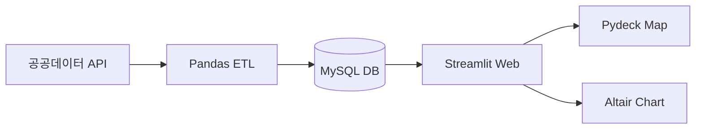

# 1. 🛫 공공데이터 분석 및 시각화 프로젝트 🚇
FastAPI와 PySpark를 활용한 대용량 데이터 분석

  
    발표 시작하기 <mdi:arrow-right class="inline"/> 
  

  
1TEAM

  

    팀장 최수아 
    팀원 김하영 
    팀원 이정빈
  

---
layout: center
---

# 📑 Index

  

    <ul class="text-sm">
      <li><a href="3" style="color: inherit; text-decoration: none;">개요</a></li>
      <li><a href="4" style="color: inherit; text-decoration: none;">주요 목표</a></li>
    </ul>
  

  

    <h3 class="text-blue-500 mb-2">
    <a href="5" style="color: inherit; text-decoration: none;">📘 1단원: 미항공 데이터 분석</a></h3>
    <ul class="text-sm">
      <li><a href="6" style="color: inherit; text-decoration: none;">WBS</a></li>
      <li><a href="7" style="color: inherit; text-decoration: none;">기능정의서</a></li>
      <li><a href="8" style="color: inherit; text-decoration: none;">기술 스택</a></li>
      <li><a href="9" style="color: inherit; text-decoration: none;">시스템 아키텍쳐</a></li>
      <li><a href="10" style="color: inherit; text-decoration: none;">주요 기능</a></li>
    </ul>
  

  

    <h3 class="text-green-500 mb-2">
    <a href="16" style="color: inherit; text-decoration: none;">📗 2단원: 서울시 지하철 데이터 분석</a></h3>
    <ul class="text-sm">
      <li><a href="17" style="color: inherit; text-decoration: none;">WBS</a></li>
      <li><a href="18" style="color: inherit; text-decoration: none;">기능정의서</a></li>
      <li><a href="19" style="color: inherit; text-decoration: none;">기술 스택</a></li>
      <li><a href="20" style="color: inherit; text-decoration: none;">시스템 아키텍쳐</a></li>
      <li><a href="21" style="color: inherit; text-decoration: none;">주요 기능</a></li>
    </ul>
  

  <ul class="text-sm">
    <li><a href="수정" style="color: inherit; text-decoration: none;">Troubleshooting</a></li>
    <li><a href="수정" style="color: inherit; text-decoration: none;">데이터 출처</a></li>
    <li><a href="수정" style="color: inherit; text-decoration: none;">Q&A</a></li>
  </ul>

---

## 📌 Project Overview 

 

### 공공 데이터 분석 
"본 포트폴리오는 항공 및 지하철의 대규모 공공데이터를 효율적으로 정제 및 적재하고, 이를 분석하여 실질적인 인사이트를 도출하는 데이터 시각화 솔루션 구현 과정을 담고 있습니다."

 

### 1. 서울시 지하철 데이터 
- 주거지역 및 산업지역 정보를 결합한 인터랙티브 지도 서비스  
- 시간대별/요일별 유동인구 데이터를 PySpark로 가공하여 역세권의 특성을 분석

 

### 2. 미항공 운항 데이터
- 다양한 항공 운항 관련 공공 데이터를 수집
- **ETL(Extract, Transform, Load)** 프로세스를 통해 정규화된 데이터베이스를 구축
- **Streamlit**을 통해 시각화 대시보드를 구현
---

## ✨ Key Goals

 

### 지하철 
* **데이터 정합성 확보:** 파편화된 지하철 좌표 데이터와 요약 데이터를 정교하게 매칭
* **대용량 처리 파이프라인:** PySpark를 이용한 시간대별 유동인구 통계 연산 및 MariaDB 적재
* **고성능 API 제공:** FastAPI를 통한 비동기 데이터 통신 및 React 시각화

  

### 항공
* **데이터 파이프라인 구축:** 항공사 코드, 공항 코드 등 파편화된 데이터를 정제하여 RDBMS 적재
* **인사이트 도출:** 항공사별 운항 리스크와 노선 전략을 제안하기 위한 통계 분석
* **공간 정보 시각화:** Pydeck을 활용하여 노선별 운항 경로 및 밀집도 시각화

---
layout: center
---

# 📘 1단원: 미항공 데이터 분석

---
layout: default
---

  🛫 미항공 데이터 분석

## WBS
이미지 캡쳐본  
<a href="https://docs.google.com/spreadsheets/d/10rcUMPnz9NZdHwDPqJMjMV1odBDm1sutQoFqZBnC7Aw/edit?gid=47234164#gid=47234164" target="_blank" class="border-b border-green-500 text-green-500 hover:text-green-400 transition">
  📊 WBS (Google Spreadsheets) 상세 보기
</a>

---
layout: default
---

  🛫 미항공 데이터 분석

## 기능정의서

<a href="https://docs.google.com/spreadsheets/d/10rcUMPnz9NZdHwDPqJMjMV1odBDm1sutQoFqZBnC7Aw/edit?gid=47234164#gid=47234164" target="_blank" class="border-b border-green-500 text-green-500 hover:text-green-400 transition">
  📊 기능정의서 (Google Spreadsheets) 상세 보기
</a>

---
layout: default
---

  🛫 미항공 데이터 분석

## 🛠️ Tech Stack

 

* **Language:** Python
* **Dashboard:** Streamlit(웹 프레임워크), Pydeck(공간 정보 시각화), Altair(통계 차트)
* **Data Processing:** Pandas(데이터 구조화 및 전처리), SQLAlchemy(DB Connection)
* **Database:** MariaDB

---
layout: default
---

  🛫 미항공 데이터 분석

## 🏗️ System Architecture
  

---
layout: default
---

  🛫 미항공 데이터 분석

## 🚀 Main Features (주요 기능)

  

| 기능 | 설명 |
| :--- | :--- |
| **⚙️ ETL 자동화** | Python을 이용해 원천 데이터를 정제 후 `db_to_air` 스키마에 자동 적재 |
| **📊 인터랙티브 대시보드** | Streamlit 기반의 실시간 항공 데이터 필터링 및 조회 기능 |
| **📍 비행 경로 시각화** | Pydeck의 `ArcLayer` 등을 활용한 출발-도착지 간 항공 노선 시각화 |
| **📈 데이터 분석 차트** | Altair를 활용한 항공사별 운항 효율성 및 리스크 분석 그래프 제공 |

---
layout: center
---

---
layout: center
---

---
layout: center
---

---
layout: center
---

---
layout: center
---

<a href="http://192.168.0.110:8501" target="_blank" class="border-b border-green-500 text-green-500 hover:text-green-400 transition">
  서비스 화면 이동
</a>

---
layout: center
---

# 📘 2단원: 서울시 지하철 데이터 분석

---
layout: default
---

  🚇 서울시 지하철 데이터 분석

## WBS
<!--  -->
 
<a href="https://docs.google.com/spreadsheets/d/10rcUMPnz9NZdHwDPqJMjMV1odBDm1sutQoFqZBnC7Aw/edit?gid=406132480#gid=406132480" target="_blank" class="border-b border-green-500 text-green-500 hover:text-green-400 transition">
  📊 WBS (Google Spreadsheets) 상세 보기
</a>

---
layout: default
---

  🚇 서울시 지하철 데이터 분석

## 기능정의서

<!--  -->

<a href="https://docs.google.com/spreadsheets/d/10rcUMPnz9NZdHwDPqJMjMV1odBDm1sutQoFqZBnC7Aw/edit?gid=47234164#gid=47234164" target="_blank" class="border-b border-green-500 text-green-500 hover:text-green-400 transition">
  📊 기능정의서 (Google Spreadsheets) 상세 보기
</a>

---
layout: default
---

  🚇 서울시 지하철 데이터 분석

## 🛠️ Tech Stack

 

* **Backend:** FastAPI, SQLAlchemy, Pydantic
* **Data Engineering:** PySpark , Pandas
* **Frontend:**  React, react-kakao-maps-sdk
* **Database:** MariaDB

---
layout: default
---

  🚇 서울시 지하철 데이터 분석

## 🏗️ System Architecture

     

 

---
layout: default
---

  🚇 서울시 지하철 데이터 분석

## 🚀 Main Features (주요 기능)

 

| 기능 | 설명 |
| :--- | :--- |
| **🖥️ 통합 대시보드** | React 기반의 직관적인 지하철 데이터 시각화 인터페이스 제공 |
| **🔄 역별 호선 통합 분석** | 서로 다른 호선의 동일 역명을 그룹화하여 전체 통계 데이터 산출 |
| **📍 카테고리 기반 탐색** | Kakao API 연동을 통한 역 주변 15종 편의시설 실시간 필터링 |
| **🛤️ 스마트 라우팅** | React Router를 활용한 페이지 전환 및 지도 중심점 이동 관리 |

> **Key Point**: 대용량 유동인구 데이터를 PySpark로 전처리했습니다.

---

대시보드(실제 ui 캡쳐본)

<a href="http://192.168.0.110:8501" target="_blank" class="border-b border-green-500 text-green-500 hover:text-green-400 transition">
  서비스 화면 이동
</a>

---

대시보드(실제 ui 캡쳐본)

---

대시보드(실제 ui 캡쳐본)

--- 

## ⚠️ Troubleshooting

1. 데이터 불일치 및 결측치 처리 (Data Integrity)
- **Problem**: 위/경도 좌표 데이터와 전체 지하철 요약 데이터 간의 불일치(특정 역의 좌표 누락) 발생.
- **Solution**: 전체 리스트를 기준으로 하되, 좌표가 없는 데이터는 **공공데이터 API 추가 호출** 또는 **법정동 중심점 좌표**를 활용해 보정하여 데이터 손실 최소화.

2. 복잡한 유동인구 시각화 (Time-series Analysis)
- **Problem**: 평일/공휴일/주말 및 시간대별 이동 인구 분석 시, 기준 시간 구분이 모호하여 데이터 왜곡 우려.
- **Solution**: **출근/퇴근/일반 시간대**로 세션을 정의하고, **PySpark**를 활용해 시간대별 가중치를 부여한 통계 모델 구축.

3. 환승역 통합 집계 (Multi-line Integration)
- **Problem**: 같은 이름의 역이 호선별로 분리되어 있어 전체 유동인구 합산 시 개별 역으로 집계됨.
- **Solution**: **역명(Station Name)**을 기준으로 `GroupBy` 연산을 수행하여 여러 호선의 데이터를 하나로 통합하는 전처리 로직 구현.

4. React-Kakao-Maps SDK 연동 이슈
- **Problem**: 라이브러리 미인식 및 지도 렌더링 높이(`0px`) 문제 발생.
- **Solution**: `react-kakao-maps-sdk` 설치 및 `libraries=services` 파라미터 추가 확인. CSS 클래스(`.kakaoMap`)에 **명시적 높이값**을 부여하여 해결.

---

## 출처

 

#### 지하철

 

-  서울교통공사, '서울교통공사_1_8호선 역사 좌표(위경도) 정보_20250814', 20260317  
    (https://www.data.go.kr/data/15099316/fileData.do?recommendDataYn=Y)
-  서울교통공사, '서울교통공사_역별 일별 시간대별 승하차인원 정보', 20260317  
    (https://www.data.go.kr/data/15048032/fileData.do)
- 서울연구데이터서비스, '지도로-본-서울-2013', 20260318  
    (https://data.si.re.kr/data/지도로-본-서울-2013/109)
- 지도: Kakao Maps API (© Kakao)

 

#### 항공

 

- Data Expo 2009: Airline on time data  
    (https://dataverse.harvard.edu/dataset.xhtml?persistentId=doi:10.7910/DVN/HG7NV7)

---
layout: center
---

## Q&A

---
layout: center
---

## THANK YOU